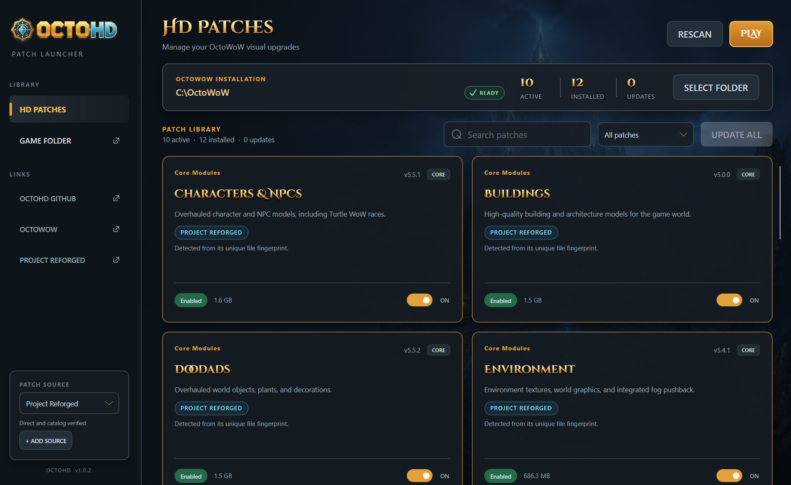

<p align="center">
  
</p>

<p align="center">
  <strong>HD patch management for OctoWoW — simple, safe, and built for every desktop.</strong>
</p>

<p align="center">
  <a href="https://github.com/octohd/launcher/releases/latest"><strong>Download OctoHD</strong></a>
  ·
  <a href="https://github.com/octohd/launcher/issues">Report an issue</a>
  ·
  <a href="CONTRIBUTING.md">Contribute</a>
</p>

<p align="center">
  <a href="https://github.com/octohd/launcher/actions/workflows/build.yml"></a>
  <a href="https://github.com/octohd/launcher/releases/latest"></a>
  <a href="https://github.com/octohd/launcher/releases"></a>
</p>

<p align="center">
  
</p>

## Your HD patch library, without the busywork

OctoHD is a focused desktop companion for installing and managing Turtle WoW HD patches in an OctoWoW installation. It downloads files directly from the selected patch source, validates them, adapts them for OctoWoW, and keeps enabled and disabled patches organized automatically.

No manual renaming. No duplicate downloads. No hunting through the `Data` directory.

### Why OctoHD?

- **Made for OctoWoW** — select either the OctoWoW folder or its `Data` folder and let OctoHD resolve the correct location.
- **One-click patch control** — install, enable, disable, or reinstall individual HD patches from a visual library.
- **Automatic dependencies** — required patches are downloaded and enabled before the patch that needs them.
- **Smart startup scan** — existing active and disabled patches are detected before the library is shown.
- **Direct downloads** — Project Reforged is the verified default source; OctoHD does not mirror patch files.
- **Custom patch sources** — add a public HTTPS or S3-compatible bucket without changing the app.
- **Safe local handling** — downloads are validated before installation and disabling a patch does not delete it.
- **Automatic app updates** — new OctoHD releases download in the background and install after restart.
- **Native desktop experience** — self-contained releases for Windows, Linux, and macOS; no separate .NET installation required.
- **Launch OctoWoW** — the Play button opens the official OctoLauncher rather than bypassing it.

## Get started

1. Download the package for your platform from the [latest release](https://github.com/octohd/launcher/releases/latest).
2. Open OctoHD and select your OctoWoW installation or `Data` folder.
3. Wait for the green validation check, then choose the patches you want.
4. Select **Play** whenever you are ready to open OctoLauncher.

OctoHD remembers your installation and patch-source settings between launches.

## Downloads

| Platform | Architectures | Package |
| --- | --- | --- |
| Windows | x64, ARM64 | Single `.exe` |
| Linux | x64, ARM64 | AppImage |
| macOS 14+ | Intel, Apple Silicon | Zipped `.app` |

All release packages include SHA-256 checksums and GitHub build-provenance attestations.

> [!IMPORTANT]
> OctoHD releases are currently distributed without commercial platform certificates. Windows SmartScreen or macOS Gatekeeper may therefore show an unknown-publisher warning. Download OctoHD only from this repository's Releases page and verify the published checksum when in doubt.

### Platform notes

<details>
<summary><strong>Windows</strong></summary>

Download the executable matching your processor and run it directly. Most Windows PCs use the x64 package. If SmartScreen appears, confirm that the file came from the official OctoHD release before continuing.

</details>

<details>
<summary><strong>Linux</strong></summary>

Make the downloaded AppImage executable, then open it:

```bash
chmod +x OctoHD-*-linux-*.AppImage
./OctoHD-*-linux-*.AppImage
```

</details>

<details>
<summary><strong>macOS</strong></summary>

Choose Apple Silicon for M-series Macs or Intel for older Macs, extract the ZIP, and move `OctoHD.app` to Applications. Because the app is not notarized, macOS may require you to approve the first launch in **System Settings → Privacy & Security**.

</details>

## Changelog

See [CHANGELOG.md](CHANGELOG.md) for the complete release history.

## Patch sources

[Project Reforged](https://projectreforged.github.io/vanilla/downloads/) is included as the default source. OctoHD downloads its HD patches directly and validates the catalog metadata before installation.

Advanced users can add a public HTTPS base URL for a compatible S3-style bucket. Custom sources must expose the expected patch files directly below that URL. URLs containing credentials, query strings, or fragments are rejected, and downloads cannot redirect outside the configured source.

> [!NOTE]
> A custom source is trusted by its URL and the metadata it returns. Only add sources you recognize and trust.

## Privacy and security

OctoHD requires no account and includes no telemetry. Settings and patch state stay on your device. The app only connects to your selected patch source and, in release builds, this repository's update channel.

- Patch contents are never modified or redistributed by OctoHD.
- Official downloads use catalog size, ETag, and SHA-256 data where available.
- Custom downloads are size-limited and locally fingerprinted.
- Release updates are matched to the current platform and verified before replacement.

Please report security issues privately using the instructions in [SECURITY.md](SECURITY.md).

## Help and community

- Found a bug? [Open a bug report](https://github.com/octohd/launcher/issues/new?template=bug-report.yml).
- Have an idea? [Start a feature request](https://github.com/octohd/launcher/issues/new?template=feature-request.yml).
- Want to help? Read the [contribution guide](CONTRIBUTING.md).
- By participating, you agree to follow the [Code of Conduct](CODE_OF_CONDUCT.md).
- Need release-integrity details? See [THIRD-PARTY-NOTICES.md](THIRD-PARTY-NOTICES.md) and the checksums attached to each release.

When reporting a patch problem, include your operating system, OctoHD version, selected source, and the exact error message. Do not attach game files, private URLs, credentials, or personal filesystem paths.

## Project boundaries

OctoHD is an independent community tool. It is not affiliated with, endorsed by, or sponsored by Blizzard Entertainment, Turtle WoW, OctoWoW, or Project Reforged. All product names, logos, and trademarks belong to their respective owners.

OctoHD does not contain World of Warcraft, OctoWoW, Turtle WoW, or Project Reforged game assets or patch archives. Users are responsible for following the terms that apply to their game installation and selected patch sources.
